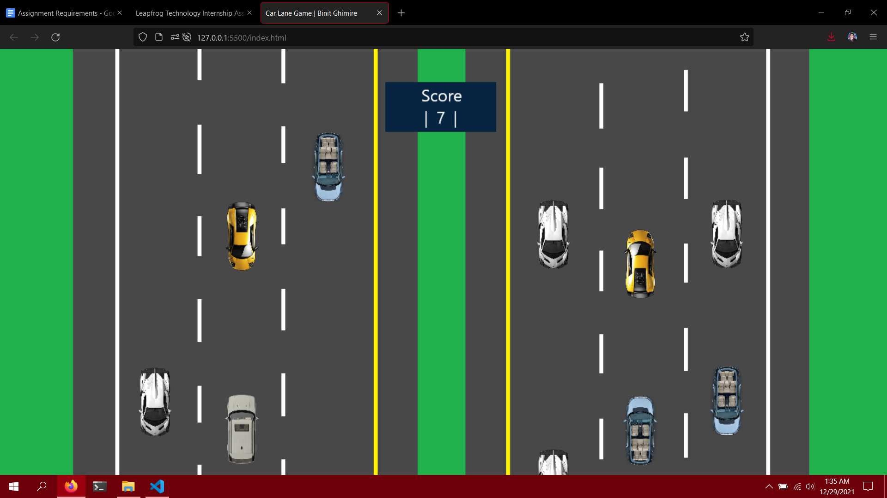

# Car Lane Game
## 2D Top-Down Lane Switching Game

### The Live Demo is [available here](https://whoisbinit.me/LF-Internship-Assignments/JS/Car%20Lane%20Game/index.html).

## Gameplay

### Screen: 1920x1080 | Document: 1536x864 | Canvas: 1280x720

## Instructions

### How to Play?

* Press A/D keys or left/right arrow keys to move the car!

### Changing game values

* Change the following values inside **`./js/gameValues.js`** in case you are willing to play the game in a different mode:
    - **DEFAULTSPEED**
    - **SPEEDTHRESHOLD**
    - **DEFAULTSCORE**